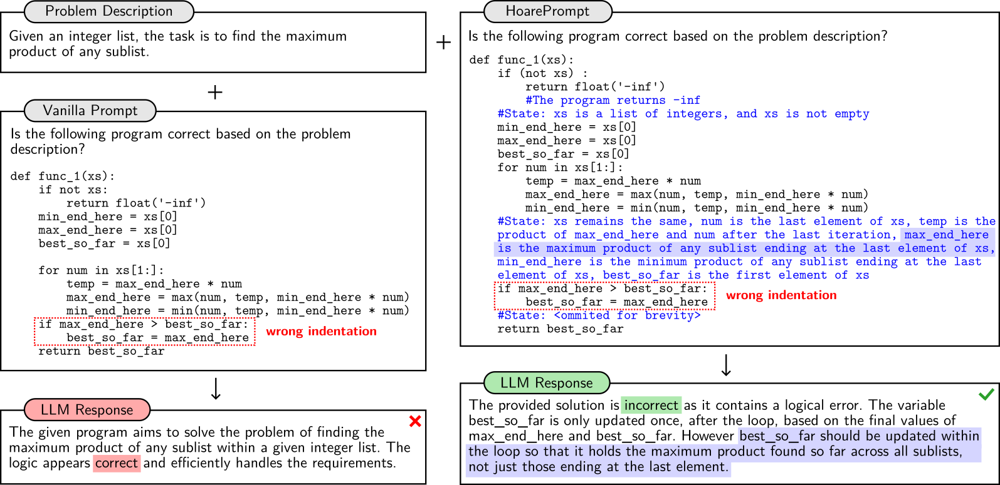

<p align="center">

</p>

# HoarePrompt: Structural Reasoning About Program Correctness in Natural Language

HoarePrompt structurally reasons about program correctness in natural language using large language models (LLMs). Drawing inspiration from the [strongest postcondition calculus](https://en.wikipedia.org/wiki/Predicate_transformer_semantics), it employs a step-by-step process to generate natural language descriptions of reachable program states at various program points. By aligning formal semantics with informal requirements, HoarePrompt enables LLMs to detect bugs that violate natural language specifications.

Key features:
1. **Correctness assessment**: classify program correctness with respect to natural language specifications, providing a verdict of `CORRECT` or `INCORRECT`.
2. **Descriptions of reachable states**: infer natural language descriptions of reachable program states without executing the program.
3. **Loop summarization**: apply a novel _few-shot-driven k-induction_ to precisely summarize the semantics of loops in natural language.

Preprint:
- **HoarePrompt: Structural Reasoning About Program Correctness in Natural Language**<br>Dimitrios Stamatios Bouras, Yihan Dai, Tairan Wang, Yingfei Xiong, Sergey Mechtaev<br>[https://arxiv.org/abs/2503.19599](https://arxiv.org/abs/2503.19599)

## Installation

### 1. Set up a Virtual Environment

To ensure dependency isolation and compatibility, it's recommended to create a virtual environment:

```bash
# Create a virtual environment
python3 -m venv hoareprompt-env

# Activate the virtual environment
source hoareprompt-env/bin/activate
```

### 2. Install Dependencies

Install the necessary dependencies by running:

```bash
pip install -r requirements.txt
```

### 3. Set API Keys

Depending on the LLM service you're using, set environment variables for the API keys.

For **OpenAI models:**
```bash
export OPENAI_API_KEY="your-openai-api-key"
```

For **Qwen models:**
```bash
export DASHSCOPE_API_KEY="your-dashscope-api-key"
```

You can add these export commands to your `.bashrc` or `.zshrc` file to avoid having to set them every time.

Additional providers and models can be configured in `src/model.py`.

## Motivating Example

To motivate our approach, we first show that annotating a program with natural language descriptions of reachable program states enhances an LLM's reasoning about program correctness.

### State Descriptions Enhance LLM Reasoning

Consider the problem: *Given an integer list, the task is to find the maximum product of any sublist.* The left side of the figure below presents a flawed implementation of Kadane’s algorithm for solving this problem.
The description and code for this example can be found at `examples/motivating_example/description.txt` and `examples/motivating_example/program.py`.

<p align="center">
  
</p>

The bug in this implementation stems from incorrect indentation, which results in `best_so_far` being updated only once—after the loop ends—instead of being updated during each iteration.

Despite the simplicity of this bug, state-of-the-art  LLMs often fail to identify it consistently, misclassifying the program as correct. Because LLMs exhibit non-deterministic behavior and are sensitive to prompt design, testing their effectiveness in detecting such errors is challenging. To provide objective evidence, we crafted six distinct prompts—including a simple "Vanilla" prompt, a Zero-shot-CoT prompt, and an open-ended prompt—each containing the problem description and the code snippet. We generated **10 responses for each prompt** using three different LLMs and various temperature settings.

| **Model**            | **Not Annotated** | **Annotated** |
|----------------------|------------------|--------------|
| Qwen2.5-7B          | 0%               | 11.7%        |
| Qwen2.5-Coder-32B   | 15%              | 85%          |
| Qwen2.5-72B         | 35%              | 85%          |

The results above show that without state annotations, LLMs rarely detect the bug. An example of an incorrect response from the Vanilla prompt is presented on the left side of the figure. However, HoarePrompt enhances this process by systematically inferring **natural preconditions and postconditions** from the problem description, then propagating **reachable program states** across the control flow.

By iteratively applying this process, HoarePrompt constructs a structured representation of program states, making it easier for LLMs to reason about correctness. With these annotations, the bug detection rate increases significantly.

## Running the Motivational Example

You can run the motivational example using the following command:

```bash
python src/hoareprompt.py --description examples/motivating_example/description.txt --program examples/motivating_example/program.py --config configs/config_motivational.json
```

Alternatively, specify the type of command and the log path too:

```bash
python src/hoareprompt.py --command assess --description examples/motivating_example/description.txt --program examples/motivating_example/program.py --config configs/config_motivational.json --log logs/motivating_example/
```

## Usage

HoarePrompt provides several commands to analyze programs.

### 1. Assess (Default Command)

This command evaluates whether a program conforms to a given problem description. If no specific command is provided, HoarePrompt defaults to `assess`.

**Usage:**
```bash
python src/hoareprompt.py --description <FILE> --program <FILE>
```
OR
```bash
python src/hoareprompt.py --command assess --description <FILE> --program <FILE>
```
OR
```bash
python src/hoareprompt.py --command assess --description <FILE> --program <FILE> --config <FILE> --log <FILE>
```

This outputs either `CORRECT` or `INCORRECT` based on the program assessment.

### 2. Extract Precondition
Generates a **precondition** from the problem description.

**Usage:**
```bash
python src/hoareprompt.py --command extract-precondition --description example/description.txt --program example/program.py
```

### 3. Compute Postcondition
Computes the **postcondition** for a program fragment.

**Usage:**
```bash
python src/hoareprompt.py --command compute-postcondition --precondition example/precondition.txt --program example/program.py
```

### 4. Check Entailment
Verifies if the computed postcondition satisfies the problem description.

**Usage:**
```bash
python src/hoareprompt.py --command check-entailment --description example/description.txt --program example/program.py --postcondition example/postcondition.txt
```

### Log and Counterexample Options

- **Log Directory:** Specify `--log` to save detailed logs.
- **Counterexample Generation:** Use `--cex <FILE>` with `assess` or `check-entailment` to generate counterexamples.

## Configuration

HoarePrompt allows users to customize its behavior using a JSON configuration file. By default, it uses `default-config.json`.

**Specify a custom config:**
```bash
python src/hoareprompt.py --config <FILE>
```

### Assessment Modes
- `naive`: Directly assesses if the program aligns with its description.
- `postcondition-entailment`: Uses postcondition analysis to check specification adherence.
- `naive-test`: Asks the LLM to generate input-output test pairs to determine correctness. Always used with 'verify-answer' as entailement-mode.

### Additional Configuration Options
- `loop-unrolling-count`: Controls loop unrolling (set `0` to disable summarization).
- `concat-simple`: Determines whether simple statements are combined for token efficiency (default `true`).
- `annotated`: Enables annotated code trees for entailment checking.
- `fsl`: Enables Few-Shot Learning (`true` by default).
- `COT` : Use or don't use Chain of Thgough reasoning with vanilla clasisifiers
  
- `entailment-mode`: Options include `naive`, `cot`, and `verify-answer`.

### Ready-to-Use Configurations

Predefined configurations for classifiers used in the HoarePrompt paper are available in the `configs` folder:
- **Vanilla:** `configs/config_tester_*.json`
- **Zero-Shot-CoT:** `configs/config_zero_shot_COT_*.json`
- **Tester-based:** `configs/config_tester_*.json`
- **HoarePrompt (3 unrolls):** `configs/config_hoareprompt_*.json`
- **HoarePrompt (no unrolls):** `configs/config_hoareprompt_no_unroll_*.json`


## Related Repositories

The HoarePrompt project consists of multiple repositories, each serving a specific function:

1. **[HoarePrompt (Main Repo)](https://github.com/msv-lab/HoarePrompt)**  (This is the current repo you are on)
   - The core repository containing the implementation of HoarePrompt, including the logic for analyzing programs, state propagation, and correctness verification.
   
2. **[HoarePrompt-data](https://github.com/msv-lab/HoarePrompt-data)**  
   - A dedicated repository for storing experimental results and datasets related to HoarePrompt evaluations. This includes correctness assessments, counterexamples, and other findings from our testing.
   
3. **[HoarePrompt-experiments](https://github.com/msv-lab/HoarePrompt-experiments)**  
   - This repository provides scripts and configurations to run large-scale experiments with HoarePrompt on various datasets. It includes automated evaluation scripts and batch processing tools.
4. **[CoCoClaNeL](https://github.com/msv-lab/CoCoClaNeL)** 
   - a dataset of recent submissions to Codeforces contests, and associated documentation.

## License

This dataset is released under the **MIT License**. See the [LICENSE](./LICENSE) file for details.
